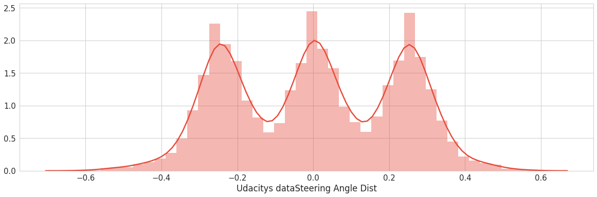
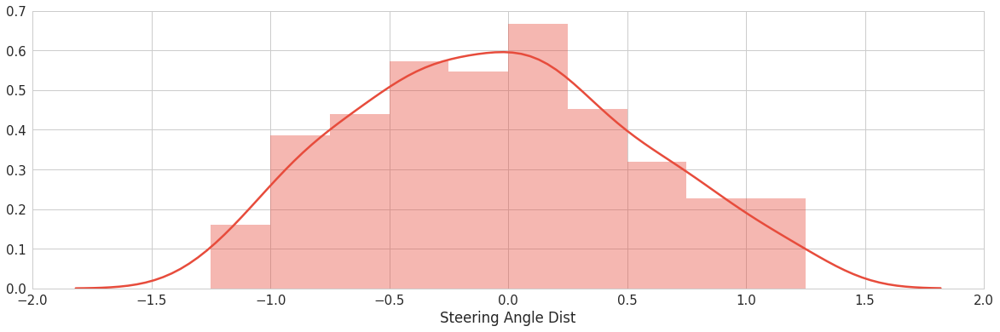
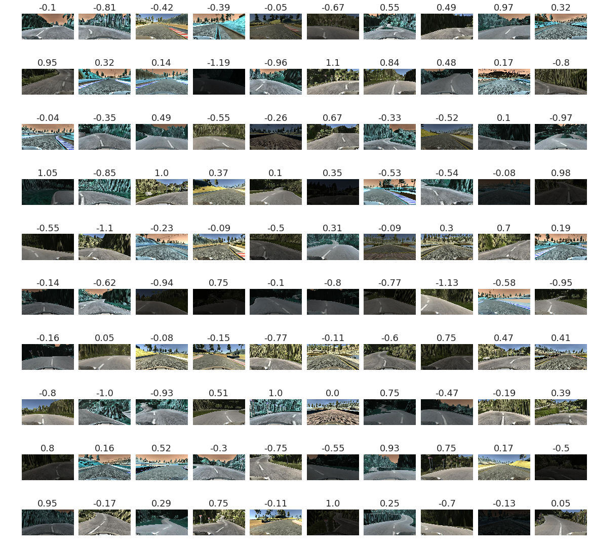

# BehavioralCloning
Tutorial for building a model that generates steering angle based on image input. A brief summary of the workflow 
## Summary of Steps
### Exploratory Visualization of Dataset
* Pandas + SeaBorn + MatPlotLib to create , load and append dataset from dataframe
* Visualization to understand the distribution and quality of data. 
* Distribution Plot to see the spread and quantity of data
* Time Series Plot to understand the quality of data. ( To see noise to determine if filters are required)

### Data Collection based on Shortcomings
- Visualizing collected data from driving the simulator shows that the dataset looks entirely different for **Keyboard** and **Mouse**
- So we pass the data through a **Savitzky Golay** filter that averages out the samples but maintains the 
- Area = (Steering_angle x Time) this effectively filters out the noise without destroying the signal.
- Based on the histogram distribution plots collecting data by using certain driving styles.
  - Data from **Track 1** - Clock wise and anticlockwise (**MAC & Windows**)
  - Data from **Track 2** - Clock wise and anticlockwise (MAC & Windows)
  - Smooth Turn from both Tracks (MAC & Windows)
  - Recovery driving from both Tracks (MAC & Windows)
  - **Problem Areas** in both tracks (MAC & Windows)
  - Keyboard and Mouse
- After initial model save and testing driving and training in problem areas to improve model on subset of data.

### Data Augmentation
* Augmentation using **Flipping**, **Translation** from left and right camera images
* Reduce the time spent on data gathering through data augmentation techniques 

### Data Perturbation to Increase Model Robustness

- **Brightness Perturbation** : Random perturbation of brightness of the image.
- **Gaussian Noise** : Blur filter with a random normal distribution across the image.
- **Adaptive Histogram Equalization** : Can greatly help in the model learning the features quickly
- **Colospace inversion** :  RBG to BGR colorspace change 

### Sampling and Image Generators 
These steps increase the challenge and generalization capability by creating harder images for the model to train on. Below is an example of augmented and perturbed image batch that is linked with the image generator that generates images during model training on the go. Seen below are the distribution of data and images of one random sample generated by the generator.

### Define model architecture
#### Data Pre-processing steps
 * Normalization through feature scaling 
 * Cropping region of interest
 * Resize image to increase model performance
  
#### Salient Features of Model
 * Batch Normalization before every activation
 * Overfitting prevention Dropouts and batch norm
 * Dropouts are implemented before the flatten layer and before the output layer with a 50% probability
 * Tried by adding multiple dropouts but it did need seem to have an effect on improving validation losses.
 * Switched from ReLU to ELU for activations after reading this paper-https://arxiv.org/abs/1511.07289
 * NVIDIA End to End Model architecture and train from scratch
 

### Setup Model Training Pipeline
- **Hyperparameters**: **Epochs** , **Steps per Epoch** and **Learning Rate** decided based on search epochs on subset of data
- **Greedy best save** and **checkpoint** implementation.
- **Metrics** is a purely **loss** based. Since the label(Steering angle) here is numeric and non-categorical , RMS Loss is used as the loss type. 
### Save and Deploy Model
* Save using **json**, **hdf5** model.
