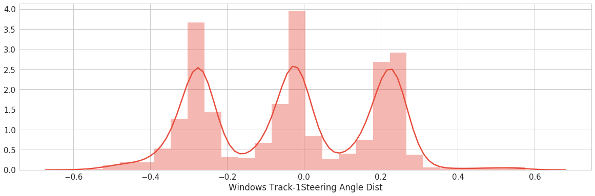
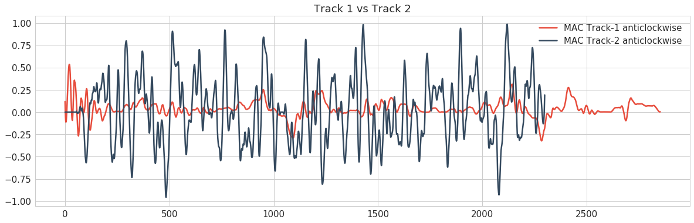
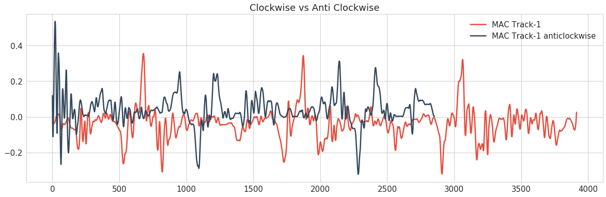

# BehavioralCloning
Tutorial for building a model that generates steering angle based on image input. A brief summary of the workflow 
## Summary of Steps
### Exploratory Visualization of Dataset
* Pandas + SeaBorn + MatPlotLib to create , load and append dataset from dataframe
* Visualization to understand the distribution and quality of data. 
* Distribution Plot to see the spread and quantity of data
* Time Series Plot to understand the quality of data. ( To see noise to determine if filters are required)

### Data Collection based on Shortcomings
* Udacity Simulator and Udacity provided data.  
* Based on the histogram distribution plots collecting data by using certain driving styles (*Lesser data with large steering angles , then drive more on curves*, clockwise and anticlockwise )
* After initial model save and testing driving and training in problem areas to improve model on subset of data.

### Data Augmentation
* Augmentation using Flipping, Translation from left and right camera images
* Reduce the time spent on data gathering through data augmentation techniques 

### Data Perturbation to Increase Model Robustness
  #### Brightness Perturbation
  * Random perturbation of brightness of the image.
  #### Gaussian Noise
  * Blur filter with a random normal distribution across the image.
  #### Histogram Equalization
  * Can greatly help in the model learning the features quickly
  #### Colospace inversion
  * Increase the challenge and generalization capability by creating harder images for the model to train on. 
### Define model architecture
#### Data Pre-processing steps
  * Normalization through feature scaling
  * Cropping region of interest
  * Resize image to increase model performance
#### Salient Features of Model
 * Batch Normalization before every activation
 * Overfitting prevention Dropouts and batch norm
 * Use NVIDIA End to End Model architecture and train from scratch 
### Setup Model Training Pipeline
* Hyperparameters- Epochs , Steps per Epoch and Learning Rate decided based on search epochs on subset of data
* Greedy best save and checkpoint implementation.
* Metrics is a purely loss based. Since the label(Steering angle) here is numeric and non-categorical , RMS Loss is used as the loss type. 
### Save and Deploy Model
* Save using json, hdf5 model.
